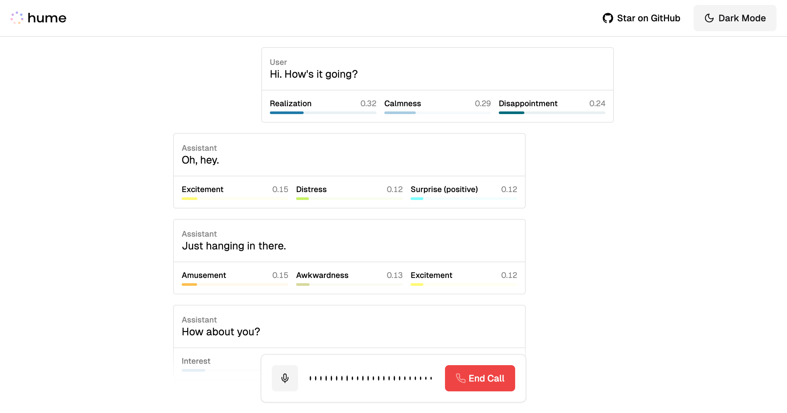

# Fragments - Islamic AI Chat Interface

<div align="center">
  <h1>🕌 Fragments</h1>
  <p><em>A Modern Islamic AI Chat Experience</em></p>
</div>



## Overview

Fragments is a beautifully crafted Islamic AI chat interface that combines modern design with traditional Islamic aesthetics. Built with Next.js and enhanced with elegant animations, it provides a unique and respectful platform for AI interactions.

## Features

- 🎨 Islamic-inspired UI design with geometric patterns
- 🌙 Elegant dark mode support
- ✨ Smooth animations and transitions
- 📱 Fully responsive design
- 🔊 Real-time voice interaction
- 🖼️ Beautiful emerald color scheme
- 🖋️ Arabic typography integration
- ⚡ Built with Next.js App Router

## Tech Stack

- Next.js 14
- TypeScript
- Tailwind CSS
- Framer Motion
- Radix UI Components
- Voice Processing Capabilities

## Getting Started

1. Clone the repository:
```bash
git clone https://github.com/owlninjam/fragments.git
```

2. Install dependencies:
```bash
npm install
# or
yarn install
# or
pnpm install
```

3. Set up your environment variables:
- Copy `.env.example` to `.env`
- Add your required API keys

4. Run the development server:
```bash
npm run dev
# or
yarn dev
# or
pnpm dev
```

Open [http://localhost:3000](http://localhost:3000) to see the result.

## Project Structure

- `/app` - Next.js app router pages and layouts
- `/components` - Reusable UI components
- `/utils` - Utility functions and helpers
- `/public` - Static assets

## Customization

The interface can be customized through:
- `tailwind.config.ts` - Theme and styling
- `app/globals.css` - Global styles and animations
- `components/*` - Individual component styling

## Contributing

Contributions are welcome! Feel free to submit issues and pull requests.

## License

This project is licensed under the MIT License - see the LICENSE file for details.

---

<div align="center">
  <p>created by <a href="https://github.com/owlninjam">@owlninjam</a></p>
  <p>بِسْمِ اللَّهِ الرَّحْمَٰنِ الرَّحِيمِ</p>
</div>
